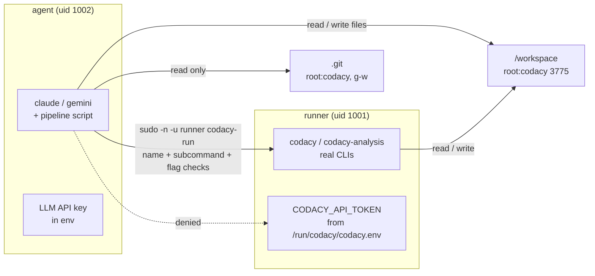
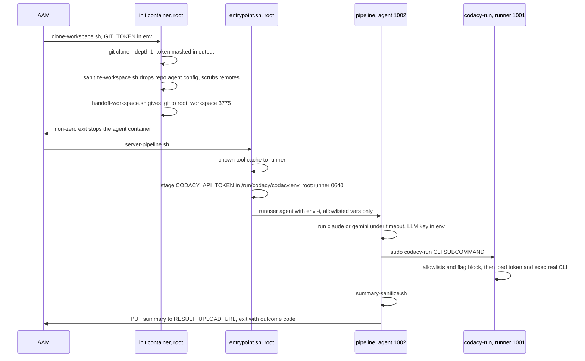

# Hardening overview

## What this container does

`codacy/autoconfig` runs an LLM agent against a customer repository to tune that repository's Codacy
Cloud configuration. The agent reads the checkout, calls the Codacy CLIs, and writes a JSON summary.
In production the Active Analysis Manager (AAM) launches it as a Kubernetes pod: a git-clone init
container fills a shared `/workspace`, then the agent container runs `server-pipeline.sh`, which
uploads the summary to a presigned S3 URL. Developers run the same image with `local-pipeline.sh`
against a mounted folder.

Two agents are supported, and the pipeline picks one from the keys it is given
(`docker/server-pipeline.sh:34-37`, `:57`, `:102`):

| Key present         | Agent that runs | Default model                          |
|---------------------|-----------------|----------------------------------------|
| `ANTHROPIC_API_KEY` | `claude`        | `claude-sonnet-4-6` (`CLAUDE_MODEL`)   |
| `GEMINI_API_KEY`    | `gemini`        | `gemini-3-flash-preview` (`GEMINI_MODEL`) |

`ANTHROPIC_API_KEY` wins when both are set. Both agent CLIs are version-pinned in the image
(`docker/Dockerfile:17-24`); the Gemini pin carries an explicit reason — its policy-engine semantics
change between minors, so a bump has to be tested rather than picked up silently. The two Codacy CLIs
are installed unpinned.

**In production only Gemini runs.** AAM passes `GEMINI_API_KEY` and leaves its `ANTHROPIC_API_KEY`
line commented out, so the Claude branch is present in the image and in both pipelines but nothing
in the cluster takes it. Everything below applies to both agents except the Gemini admin policy,
which has no Claude counterpart — see [Claude is not hardened](#claude-is-not-hardened).

## Threat model

The repository is **untrusted input**. It is customer-controlled, arrives before the agent starts,
and everything in it — source files, git config, agent instruction files — is assumed hostile. The
agent itself is **semi-trusted**: it is a language model driven partly by text out of that
repository, so prompt injection is treated as a live path to arbitrary tool calls, not a hypothetical.

Attacks in scope:

1. **Credential theft.** The Codacy API token, the git clone token, and the LLM API key are the
   valuable objects in the pod. A hijacked agent that reads one of them exfiltrates it.
2. **Instruction injection.** A repository that ships `.claude/`, `.gemini/`, `CLAUDE.md`,
   `GEMINI.md`, `AGENTS.md`, or `.mcp.json` steers the agent, adds MCP servers, or widens tool
   permissions.
3. **Code execution as the token holder.** Git config carries executable settings
   (`core.fsmonitor`, `core.pager`, hooks), and local analysis runs repository-supplied tool configs.
   Either one executes attacker code as whichever user holds the Codacy token.
4. **Destructive configuration.** The agent tunes a repository; it must not be able to reset one
   (`--force`, `--disable-all`, `--unlink-standard`).
5. **Leakage through the artifacts.** Container stdout is captured by AAM, and the summary JSON is
   uploaded and stored. A credential echoed into either travels far outside the pod.

Out of scope, deliberately: the LLM provider itself, and network egress from inside the container
(see [Egress](#egress)).

## Secrets inventory

| Secret               | Reaches                                     | Where it lives                                                      | Evidence |
|----------------------|---------------------------------------------|---------------------------------------------------------------------|----------|
| `GIT_TOKEN`          | clone init container only                   | Env of a container that exits before the agent container starts     | `docker/clone-workspace.sh:15-20`, `docker/entrypoint.sh:6-12` |
| `CODACY_API_TOKEN`   | `runner` only, never the agent              | `/run/codacy/codacy.env`, `root:runner` `0640`, in a `0750` dir     | `docker/entrypoint.sh:19-38`, `docker/codacy-run.sh:49-51` |
| `CODACY_API_BASE_URL`| `runner` only                               | Same staged file — only the Codacy CLI reads it                     | `docker/entrypoint.sh:33-35` |
| `RESULT_UPLOAD_URL`  | pipeline process, **not** the agent process | Unset for the agent via `env -u`                                    | `docker/server-pipeline.sh:54`, `:62`, `:112` |
| `ANTHROPIC_API_KEY` / `GEMINI_API_KEY` | the agent process        | Plain environment variable — see below                              | `docker/entrypoint.sh:51` |

### The LLM key is really in the agent's environment

There is no auth proxy. `env -i` re-adds `ANTHROPIC_API_KEY` and `GEMINI_API_KEY` verbatim
(`docker/entrypoint.sh:51`), because the CLI reads the key from its own environment. A hijacked agent
can read its own key. The hardening test asserts exactly this and calls it correct behaviour
(`test/test-hardening.sh`, `DROP_GEMINI=present`).

The mitigation for `GEMINI_API_KEY` is **operational, not in-container**: the key is IP-restricted to
the cluster's egress address, so a copied key is not usable from elsewhere. That control lives in the
Google Cloud project and the cluster's egress setup — nothing in this repository implements or
enforces it, and it does not stop misuse from inside the pod. Everything else here is built on the
assumption that this key may leak.

The two other credentials — the Codacy token and the git token — are genuinely out of the agent's
reach, and that is the boundary this repository actually enforces.

## Two-user model

The image builds two unprivileged users (`docker/Dockerfile:32-35`):

- **`runner` (uid 1001)** — holds the Codacy token and runs the real Codacy CLIs.
- **`agent` (uid 1002)** — runs `claude`/`gemini` and the pipeline script. Holds no Codacy credential.
- **group `codacy` (1003)** — shared by both, so both can read and write `/workspace/.codacy`.
- **group `runner` (1004)** — exactly one member, so the staged token file can be readable by
  `runner` alone. The shared `codacy` group would have handed it to the agent too.

The Codacy tool cache lives in `runner`'s home at `/home/runner/.codacy`, mode `0700`
(`docker/Dockerfile:45-47`) — the agent cannot read or plant anything in it. The container starts as
root (`docker/Dockerfile:79`) only so the entrypoint can do the privileged staging; it never runs the
agent as root.


```mermaid
flowchart LR
  subgraph agentproc["agent (uid 1002)"]
    A["claude / gemini<br/>+ pipeline script"]
    K["LLM API key<br/>in env"]
  end
  subgraph runnerproc["runner (uid 1001)"]
    R["codacy / codacy-analysis<br/>real CLIs"]
    T["CODACY_API_TOKEN<br/>from /run/codacy/codacy.env"]
  end
  W["/workspace<br/>root:codacy 3775"]
  G[".git<br/>root:codacy, g-w"]
  A -->|"sudo -n -u runner codacy-run<br/>name + subcommand + flag checks"| R
  A -->|"read / write files"| W
  A -->|"read only"| G
  R -->|"read / write"| W
  A -.->|"denied"| T
```

## Clone, sanitize, handoff

`clone-workspace.sh` runs as the init container and must finish successfully before the agent
container starts — a non-zero exit keeps the agent from running at all.

1. **Clone.** An HTTPS URL is built per provider (`gh`/`ghe`, `gl`/`gle`, `bb`) with `GIT_TOKEN`
   embedded, and clone output is passed through `sed` so the token cannot appear in the log
   (`docker/clone-workspace.sh:36-63`).
2. **Sanitize** (`docker/sanitize-workspace.sh`):
   - Removes every repository-supplied agent-config path: directories `.claude` and `.gemini`,
     files `.mcp.json`, `CLAUDE.md`, `CLAUDE.local.md`, `GEMINI.md`, `AGENTS.md`, at any depth,
     skipping `.git` (`:18-33`). This is a control against a hostile repository — it is not about
     either agent's features.
   - Scrubs `user:pass@` credentials out of every git remote URL, drops
     `http.extraheader`, and re-checks `.git/config` afterwards, failing the run if anything remains
     (`:35-77`). The clone token must not survive in the checkout the agent inherits.
3. **Handoff** (`docker/handoff-workspace.sh`):
   - `agent:codacy` owns the working tree (`:18`).
   - `.git` becomes `root:codacy` with group-write stripped (`:20-23`), so the agent can read history
     but cannot write git config — otherwise `core.fsmonitor`/`core.pager`/hooks would execute as
     `runner`, the token holder, on the CLIs' next git call.
   - The workspace root itself stays `root:codacy` mode `3775` — sticky + setgid (`:29-30`). Without
     the sticky bit the agent could not write `.git`, but could rename it aside and drop in a `.git`
     of its own, which the image's `safe.directory /workspace`
     (`docker/Dockerfile:50`) would then accept. Sticky lets the agent create and remove only its own
     entries; setgid keeps new files in the shared group.

`test/test-hardening.sh` asserts the resulting shape: agent owns the checkout, root owns
`.git`, the agent cannot write `.git/config`, cannot rename or delete `.git`, and can still read the
repo, run `git status`/`git diff`, and create files in `/workspace`.

Note that sanitize and handoff belong to the clone flow. `local-pipeline.sh` runs against a folder
the developer mounted and does not call them — local runs are trusted by design.

## The Codacy CLI shim

The agent never executes the real Codacy CLIs. In the image, `codacy` and `codacy-analysis` are
moved to `codacy-real` / `codacy-analysis-real` in the same directory, so their relative npm
symlinks stay valid, and the shim takes over the original names (`docker/Dockerfile:38-43`). The
only sudo grant in the image is one line (`docker/Dockerfile:74-76`):

```
agent ALL=(runner) NOPASSWD: /usr/local/bin/codacy-run
```

`codacy-shim.sh:7` calls it as `sudo -n -H -u runner /usr/local/bin/codacy-run "$(basename "$0")" "$@"`.
Because the sudo rule permits any arguments, every restriction has to live in `codacy-run.sh`:

| Check | What it stops | Evidence |
|-------|---------------|----------|
| CLI-name allowlist (`codacy`, `codacy-analysis`) | A traversal path such as `../../workspace/evil` running as `runner` with the token loaded | `docker/codacy-run.sh:14-17` |
| Subcommand allowlist — `codacy-analysis`: `info init config`; `codacy`: `repo issues tools tool pattern patterns` | `codacy-analysis analyze`, which runs repository tool configs locally as `runner`; also `codacy login` | `docker/codacy-run.sh:22-25` |
| Subcommand must be argument 1 | A value-taking global flag occupying that slot and smuggling a denied subcommand through (`codacy-analysis --directory info analyze`) | `docker/codacy-run.sh:26-39` |
| Destructive-flag block — `--force`, `--unlink-standard`, `--disable-all`, and any single-dash cluster containing `K` or `X` | Resetting a repository's configuration instead of tuning it | `docker/codacy-run.sh:40-48` |

Only after all four does it source the token file and `exec` the real CLI
(`docker/codacy-run.sh:49-52`). `--help`/`-h`/`--version`/`-V` pass, since they run no subcommand.

`test/test-hardening.sh` covers each of these, including the two
flag-smuggling variants and all ten destructive-flag forms.

## Gemini admin policy (Gemini only)

Both pipelines invoke Gemini with `-y` (yolo) and `--skip-trust`
(`docker/server-pipeline.sh:114`, `docker/local-pipeline.sh:74`), which auto-approves tool calls. The
counterweight is a root-owned admin-tier policy baked into the image:

| File in repo | Installed as |
|--------------|--------------|
| `docker/gemini-policy.toml` | `/etc/gemini-cli/policies/10-codacy-lockdown.toml` |
| `docker/gemini-settings.json` | `/etc/gemini-cli/settings.json` |

Both are `root:root` `0644` inside `0755` directories (`docker/Dockerfile:66-71`). The ownership is
load-bearing, not hygiene: the CLI skips a policy directory that is not root-owned, so a writable
directory means no policy at all. The policy engine is tiered — an admin-tier `deny` outranks the
allow-all rule that `-y` installs, and any settings or policy found inside the analysed repository sit
at a lower tier and cannot override it. The file declares itself as tier 5
(`docker/gemini-policy.toml:1`).

The three rules it contains (`docker/gemini-policy.toml:2-19`):

1. `web_fetch` and `google_web_search` → `deny`, priority 900, with the message "Network egress tools
   are disabled by Codacy policy."
2. Every tool of every MCP server (`toolName = "*"`, `mcpName = "*"`) → `deny`, priority 900.
3. `run_shell_command` with a command prefix of `curl`, `wget`, `nc`, `ssh`, `git push`, `sudo`, or
   `docker` → `deny`, priority 950.

Rule 3 matches the command the model asks to run, not what that command execs internally, which is
why the Codacy CLI shims — themselves `sudo` wrappers — remain usable. `test/test-hardening.sh`
checks that against a fake local Gemini gateway: `-y` does auto-approve an unlisted shell command,
`curl` comes back `policy_violation`, `web_fetch` is not even registered as a tool, no egress attempt
lands, and `codacy --version` still gets through.

The system-scope settings file adds `security.blockGitExtensions: true` and an empty `mcp.allowed`
list (`docker/gemini-settings.json:1`).

**This is defence in depth, not the boundary.** Upstream documentation for the Gemini CLI describes
its policy and approval machinery as a safety guardrail rather than a foolproof security boundary
(upstream guidance — nothing in this repository verifies it), and a model that finds a phrasing the
prefix rules do not match is a bug class, not a surprise. The OS
layer — separate users, an unreachable token, a read-only `.git`, and the shim allowlists — is what
actually contains a hostile repository. The admin policy raises the cost of the first step.

## Claude is not hardened

**Accepted risk.** Claude has no counterpart to the Gemini admin policy: no deny list, no
managed-settings file, no bypass lock. Its permissions come from the image's own user-scope settings
(`docker/claude-settings.json`), which grant `Bash(*)`, unscoped `Read`/`Write`/`Edit`, and
`WebFetch(*)`. `WebFetch(*)` in particular is a fetch-anything path through the model's own tool, so
a Claude run is not contained the way a Gemini run is.

This is tolerable **only** while the Claude path stays unused in production. It is a deliberate
decision, taken 2026-08-11 with the gap described: closing it was declined, not overlooked. Anyone
enabling `ANTHROPIC_API_KEY` in a cluster must revisit it first. Note also that `api.anthropic.com`
is deliberately absent from the egress allowlist, so a Claude run in the cluster fails outright until
that host is added.

Claude keeps the protections it already had on `main`, and they are pre-existing, not part of this
work (`docker/server-pipeline.sh:67-68`, `docker/local-pipeline.sh:28-29`):

- `--setting-sources user` — only user-scope settings are loaded, so a `.claude/settings.json` inside
  the repository is ignored even if one appeared after sanitization.
- `--strict-mcp-config` — a repository-supplied `.mcp.json` cannot add MCP servers.

Everything in the OS layer — the two users, the unreachable Codacy token, the read-only `.git`, the
shim allowlists, the summary sanitizer — applies to Claude exactly as it does to Gemini. That layer,
not tool-level denials, is what contains a Claude run.

The one Claude change in this work is a path: its skills and user-scope settings install under
`/home/agent/.claude` instead of `/home/node/.claude` (`docker/Dockerfile:84-91`), because the agent
process runs as the `agent` user. Leaving them at the old path would break Claude entirely.
`test/repo-config-injection-test.sh` drives the real `claude` binary as its positive control, so it
fails if that move is wrong.

## Summary sanitizer (both agents)

`summary-sanitize.sh` rewrites the summary JSON in place before it leaves the container, and both
pipelines call it after every write to the file and before upload
(`docker/server-pipeline.sh:169-172`, `docker/local-pipeline.sh:121-124`). A failure is fatal — the
server pipeline refuses to upload.

Redacted shapes (`docker/summary-sanitize.sh:13-19`): `sk-ant-…`, bearer-style `sk-…`,
`ghp_`/`gho_`/`ghs_`/`github_pat_` prefixes, and the two Google/Gemini key shapes `AIza…` and `AQ.…`.
The Google shapes matter most, since `GEMINI_API_KEY` is genuinely in the agent's environment. There
is deliberately no generic long-hex rule: a summary legitimately carries commit SHAs and content
hashes, and redacting those would corrupt the report
(`test/test-hardening.sh` asserts both the redactions and that a commit SHA survives).

Prompt-level hygiene backs this up but is not a control: `SECRECY_RULES`
(`docker/agent-lib.sh:19-35`) is appended to both agents' instructions, telling them never to print
credentials, never to run `env`/`printenv`/`git remote -v`, and to keep the summary to configuration
data. It is advisory text to a language model — treat it as noise reduction, not enforcement.

## Egress

Egress is **not restricted inside the container**. The agent's process can open sockets; the Gemini
admin policy denies the CLI's own fetch tools and a handful of shell command prefixes, and Claude has
no such denial at all. Do not read either as a network boundary.

In production, egress is enforced outside this image by a Kubernetes NetworkPolicy on the AAM-launched
pod, which is also what makes the IP restriction on `GEMINI_API_KEY` meaningful. That policy is not in
this repository — nothing here can verify or enforce it.

Local runs are trusted and unrestricted.

## Startup sequence


```mermaid
sequenceDiagram
  participant AAM
  participant Init as init container, root
  participant Entry as entrypoint.sh, root
  participant Agent as pipeline, agent 1002
  participant Runner as codacy-run, runner 1001
  AAM->>Init: clone-workspace.sh, GIT_TOKEN in env
  Init->>Init: git clone --depth 1, token masked in output
  Init->>Init: sanitize-workspace.sh drops repo agent config, scrubs remotes
  Init->>Init: handoff-workspace.sh gives .git to root, workspace 3775
  Init-->>AAM: non-zero exit stops the agent container
  AAM->>Entry: server-pipeline.sh
  Entry->>Entry: chown tool cache to runner
  Entry->>Entry: stage CODACY_API_TOKEN in /run/codacy/codacy.env, root:runner 0640
  Entry->>Agent: runuser agent with env -i, allowlisted vars only
  Agent->>Agent: run claude or gemini under timeout, LLM key in env
  Agent->>Runner: sudo codacy-run CLI SUBCOMMAND
  Runner->>Runner: allowlists and flag block, then load token and exec real CLI
  Agent->>Agent: summary-sanitize.sh
  Agent->>AAM: PUT summary to RESULT_UPLOAD_URL, exit with outcome code
```

The privilege drop is an `env -i` allowlist, not a filter: everything is cleared and only the
non-secret variables the pipelines read are re-added, plus the LLM keys
(`docker/entrypoint.sh:44-55`). `CODACY_API_TOKEN` and `CODACY_API_BASE_URL` are absent by
construction. One exception exists by design: an argument of `clone-workspace.sh` is `exec`'d
untouched (`docker/entrypoint.sh:10-12`), because the clone container needs `GIT_TOKEN` and exits
before any agent exists.

The agent also runs under `timeout --signal=TERM --kill-after=1m`, defaulting to 70 minutes
(`docker/server-pipeline.sh:43`, `:63`) — nothing inside the pod otherwise bounds a stalled agent.

## Control summary

| Control | Scope | Where |
|---------|-------|-------|
| Repo agent-config removal (`.claude`, `.gemini`, `CLAUDE.md`, `GEMINI.md`, `AGENTS.md`, `.mcp.json`) | Agent-agnostic | `docker/sanitize-workspace.sh:18-33` |
| Clone-credential scrub from remotes and `.git/config` | Agent-agnostic | `docker/sanitize-workspace.sh:35-77` |
| `GIT_TOKEN` confined to an init container that exits first | Agent-agnostic | `docker/clone-workspace.sh`, `docker/entrypoint.sh:6-12` |
| `.git` root-owned, group-write stripped | Agent-agnostic | `docker/handoff-workspace.sh:20-23` |
| Workspace root root-owned, sticky + setgid | Agent-agnostic | `docker/handoff-workspace.sh:29-30` |
| Two users, shared group, single-member `runner` group | Agent-agnostic | `docker/Dockerfile:32-35` |
| Codacy token staged in a runner-only file, never in argv or the agent env | Agent-agnostic | `docker/entrypoint.sh:19-38` |
| `env -i` allowlist on privilege drop | Agent-agnostic | `docker/entrypoint.sh:47-55` |
| `RESULT_UPLOAD_URL` removed from the agent's environment | Agent-agnostic | `docker/server-pipeline.sh:54` |
| Tool cache `0700` in `runner`'s home | Agent-agnostic | `docker/Dockerfile:45-47` |
| Sudo grant limited to one launcher, one target user | Agent-agnostic | `docker/Dockerfile:74-76` |
| CLI-name + subcommand allowlists, subcommand-first rule | Agent-agnostic | `docker/codacy-run.sh:14-39` |
| Destructive-flag block | Agent-agnostic | `docker/codacy-run.sh:40-48` |
| Summary secret redaction, incl. Google/Gemini key shapes | Agent-agnostic | `docker/summary-sanitize.sh` |
| Agent wall-clock timeout | Agent-agnostic | `docker/server-pipeline.sh:43`, `docker/local-pipeline.sh:12` |
| Secrecy rules appended to the prompt (advisory) | Agent-agnostic | `docker/agent-lib.sh:19-35` |
| Root-owned admin policy: deny fetch/search tools, all MCP tools, egress shell prefixes | **Gemini only** | `docker/gemini-policy.toml`, `docker/Dockerfile:66-71` |
| System settings: `blockGitExtensions`, empty MCP allowlist | **Gemini only** | `docker/gemini-settings.json` |
| CLI version pin justified by policy-engine semantics | **Gemini only** | `docker/Dockerfile:18-19` |
| `--setting-sources user`, `--strict-mcp-config` (pre-existing) | **Claude only** | `docker/server-pipeline.sh:67-68` |
| No tool policy, no managed settings — `Bash(*)`, `WebFetch(*)` | **Claude only, accepted risk** | `docker/claude-settings.json` |
| IP-restricted `GEMINI_API_KEY` | Operational, outside this repo | not enforced here |
| Network egress restriction | Operational, outside this repo | Kubernetes NetworkPolicy |

## Verifying it

`test/test-hardening.sh` runs the probes against a built image and diffs every `KEY=VALUE` line
against one expected block — policy config, policy enforcement against a fake local Gemini gateway,
the summary sanitizer, the user model, the privilege drop, the destructive-flag block, the
subcommand allowlist, and the `.git` lockdown. `test/repo-config-injection-test.sh` checks that a
repository shipping agent config cannot execute commands in the runner; it drives the real `claude`
binary, so it is also what keeps the Claude path from silently breaking. Both run in CI on every
build (`.circleci/config.yml`).

```bash
docker build -f docker/Dockerfile -t codacy/autoconfig:test .
test/test-hardening.sh codacy/autoconfig:test
test/repo-config-injection-test.sh codacy/autoconfig:test
```
